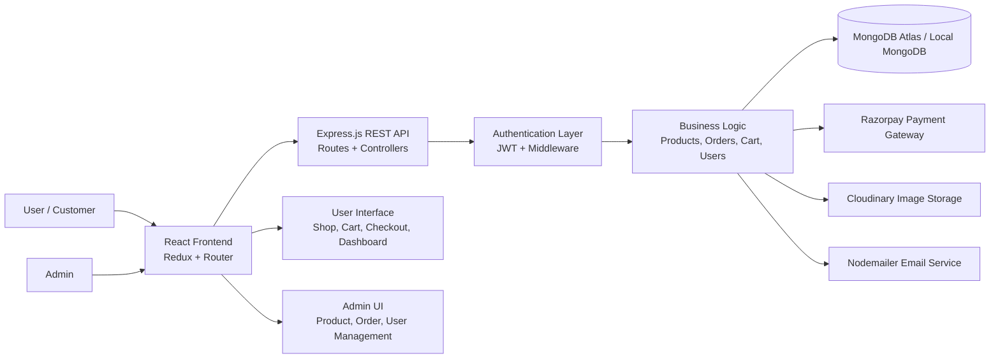

# ✨ Anvexa

Anvexa is a modern full-stack e-commerce platform built with the MERN stack. It allows customers to browse products, add items to the cart, place orders, and manage their profile, while admins can manage products, users, orders, and sales data from a dashboard.

## 📖  Overview

This project combines:

- 🎨 A React frontend for the shopping experience
- ⚙️ An Express + Node backend for APIs and auth
- 🗄️ MongoDB for persistent data storage
- ☁️ Cloudinary for product image uploads
- 💳 Razorpay integration for payments
- 🔐 JWT-based authentication and role-based access control

---

## 🚀 Features

### 🛍️ Customer Features

- User registration and login
- JWT-based authentication
- Product listing and details
- Search and category browsing
- Cart management
- Checkout flow
- Order history and status tracking
- Profile management

### 👨‍💼 Admin Features

- Admin dashboard
- Product CRUD management
- Order management
- User management
- Revenue and analytics overview
- Sales reporting

---

## 🛠️ Tech Stack

### 🎨 Frontend

- React.js
- Redux Toolkit
- React Router DOM
- Axios
- React Toastify

### ⚙️ Backend

- Node.js
- Express.js
- MongoDB
- Mongoose
- JWT
- bcryptjs

### 🔗 Third-Party Services

- Razorpay
- Cloudinary
- Nodemailer

### 🤖 AI-Ready / Smart Commerce Features

- Product recommendation cards based on category and purchase patterns
- Smart search suggestions for popular products and keywords
- Chatbot-style FAQ assistant for common shopping questions
- Admin sales insights dashboard with trend summaries
- Personalized homepage banners for returning users
- Auto-tagging for product categories using simple AI/keyword logic
- Review sentiment summary for customer feedback

### ☁️ Deployment

- Render
- MongoDB Atlas

---

## 🔐 Demo Testing Credentials

Use the following account to test the user side of the application:

- Name: User Test
- Email: user@gmail.com
- Password: user@123

> ⚠️ These credentials are intended for local testing and demo use.

---

## 🏗️  System Architecture

Anvexa follows a layered 3-tier architecture with a React frontend, an Express backend, and MongoDB data layer. The platform is designed to separate client experience, business logic, and persistent storage while integrating external services like payment and media processing.

### High-Level Architecture



### Architecture Components

#### 1. Presentation Layer
- React.js frontend serves the storefront and admin dashboard
- Redux Toolkit manages cart and state
- React Router handles page navigation
- Components include home, shop, product detail, cart, checkout, profile, and admin panels

#### 2. Application Layer
- Express.js server handles API requests
- Route modules define endpoints for auth, products, orders, payments, and analytics
- Controllers process requests and execute business rules
- Middleware enforces JWT authentication and admin authorization

#### 3. Data Layer
- MongoDB stores users, products, orders, and analytics data
- Mongoose models structure the data and validate schemas
- Data is accessed through backend controllers and services

#### 4. External Services
- Razorpay: payment processing for checkout
- Cloudinary: image upload and storage for product media
- Nodemailer: email notifications and contact communication

#### 5. Security Layer
- bcryptjs encrypts passwords
- JWT tokens handle user session management
- Role-based access control restricts admin-specific routes and actions
- CORS and environment-based configuration protect backend exposure

### Request Flow

1. User opens the frontend and logs in or registers
2. React app sends requests to the backend through REST APIs
3. Backend validates auth, applies middleware, and executes the required logic
4. Database operations are performed in MongoDB
5. Responses are returned to the frontend for UI updates
6. Payments, media uploads, and notifications are handled through external services

### Admin Workflow

- Admin logs in with admin privileges
- Admin can add, update, or remove products
- Orders can be managed and tracked
- Revenue analytics and user activity are reviewed from the dashboard

### Customer Workflow

- Customer browses products and views details
- Customer adds items to cart and proceeds to checkout
- Secure payment is processed via Razorpay
- Order is created and saved in MongoDB
- User can view order history and profile information

---

## Project Structure

```bash
anvexa/
├── backend/
│   ├── config/
│   ├── controllers/
│   ├── middleware/
│   ├── models/
│   ├── routes/
│   ├── uploads/
│   ├── utils/
│   ├── index.js
│   ├── package.json
│   └── seed.js
├── frontend/
│   ├── public/
│   ├── src/
│   ├── package.json
│   └── build/
├── package.json
├── README.md
```

---

## Getting Started

### 1. Install dependencies

From the root folder:

```bash
npm install
```

This will install the root dependencies, and you can also run the backend/frontend installs individually if needed.

### 2. Configure environment variables

Create a `.env` file in the `backend` folder with the required values, for example:

```env
PORT=5000
MONGO_URI=your_mongodb_connection_string
JWT_SECRET=your_jwt_secret
CLOUDINARY_CLOUD_NAME=your_cloud_name
CLOUDINARY_API_KEY=your_cloudinary_api_key
CLOUDINARY_API_SECRET=your_cloudinary_api_secret
RAZORPAY_KEY_ID=your_razorpay_key_id
RAZORPAY_KEY_SECRET=your_razorpay_key_secret
EMAIL_USER=your_email
EMAIL_PASS=your_email_password
```

### 3. Start the app

Run both frontend and backend together:

```bash
npm run dev
```

This starts:

- Backend: `npm --prefix backend run dev`
- Frontend: `npm --prefix frontend run dev`

### 4. Seed data (optional)

```bash
npm run seed
```

---

## Available Scripts

### Root scripts

```bash
npm run dev          # start backend + frontend
npm run build        # create frontend production build
npm run start        # start backend server
npm run seed         # run backend seed script
```

### Backend scripts

```bash
cd backend
npm start
npm run dev
npm run seed
```

### Frontend scripts

```bash
cd frontend
npm start
npm run build
npm test
```

---


## 🎯 Conclusion

Anvexa brings together the essential components of a modern online store into a single full-stack application. From user authentication to product management and payment processing, the platform demonstrates a realistic approach to building an e-commerce system with a clean frontend, a secure backend, and a scalable database foundation.
It is a strong example of how a full-stack project can be organized for both demo use and future growth.

✨ Anvexa — Discover More, Shop Smarter.

<!-- # Anvexa
Major Project is Loading.... -->

<!-- 📖 **[Read the Documentation](###)**
https://1drv.ms/w/c/d503fb3325128f00/IQBuHhlgOtIxQ52EcGvqupgTAWNkkWHqUsdFjXcptsvYOAg?e=cyuIrN -->

<!-- ✅ AI roadmap added in a structured format
I added a clear implementation plan to README.md, organized by difficulty level:

Level 1: Easy / Quick Wins

Smart Search Suggestions
Product Recommendation Cards
FAQ Chatbot
Level 2: Medium / Good Portfolio Features

Personalized Homepage
Admin Sales Insights
Review Sentiment Summary
Level 3: Advanced / Long-Term

Auto-Tagging
AI Search & Intent Matching
Customer Behavior Prediction
I also included:

recommended build order
suggested tech stack for AI features
a realistic sequence for implementation
This gives you a clean roadmap that feels practical and resume-friendly.

### AI Implementation Roadmap

#### Level 1: Easy / Quick Wins

- Smart Search Suggestions
  - Use product title and category metadata
  - Show keyword-based suggestions while typing
  - Build in frontend using local filtering and backend query hints

- Product Recommendation Cards
  - Recommend products from similar categories or top sellers
  - Use a simple rule-based system first
  - Example: if user views electronics, show related electronics products

- FAQ Chatbot
  - Create a small FAQ dataset in backend
  - Match user questions with keywords
  - Return the best answer without needing a large AI model

#### Level 2: Medium / Good Portfolio Features

- Personalized Homepage Banners
  - Track user activity and recent product views
  - Show trending or recommended products based on their behavior
  - Store simple user preference data in MongoDB

- Admin Sales Insights Dashboard
  - Aggregate orders by date, category, and revenue
  - Display charts using React + backend analytics APIs
  - Add monthly trend summaries for better admin decisions

- Review Sentiment Summary
  - Collect customer reviews from MongoDB
  - Use a lightweight sentiment model or keyword score
  - Show positive, neutral, and negative summary counts

#### Level 3: Advanced / Long-Term

- Auto-Tagging for Products
  - Use AI/keyword classification to assign categories and tags automatically
  - Integrate a small NLP or OpenAI-based service for better labeling
  - Store generated tags in the product model

- AI-Powered Search and Intent Matching
  - Improve product search with semantic matching and ranking
  - Use embeddings or search APIs for better results
  - Add fallback logic to normal search when AI is unavailable

- Customer Behavior Prediction
  - Predict likely purchases or cart abandonment patterns
  - Create reports from user actions and order histories
  - Use ML models or rules generated from past data

### Recommended Build Order

1. Smart Search Suggestions
2. Product Recommendations
3. FAQ Chatbot
4. Personalized Homepage
5. Admin Sales Insights
6. Sentiment Summary
7. Auto-Tagging
8. AI Search + Prediction

### Suggested Tech Stack for AI Features

- Frontend: React, Redux Toolkit
- Backend: Node.js, Express.js, MongoDB
- AI Helpers: Olama model, Python scripts, lightweight NLP models
- Analytics: Charting library, MongoDB aggregation queries
- Optional: Redis for fast recommendation caching. -->
